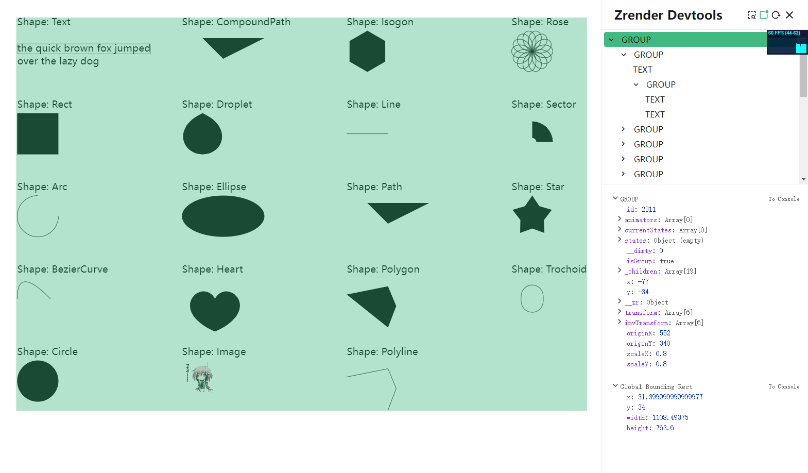

# Zrender Devtools

Devtools for Zrender help you to debug your Zrender code.



## Install

```bash
npm install zrender-devtools
```

## Usage
```typescript
import { init } from 'zrender';
import { createDevtools } from 'zrender-devtools';

const zr = init('root')

createDevtools(zr).mount('#wrapper')
```
